
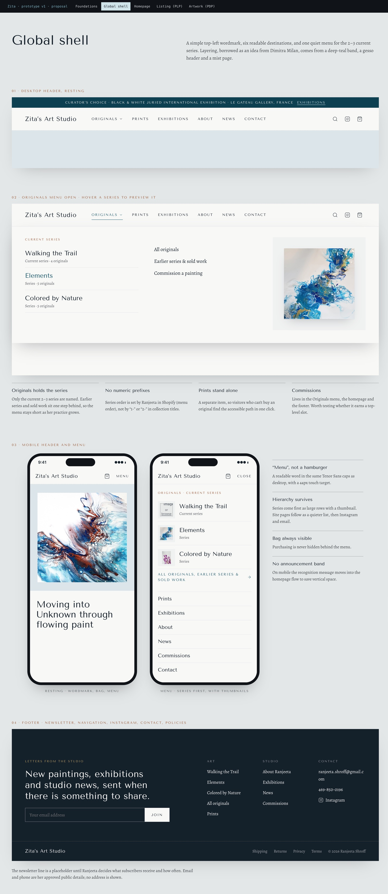

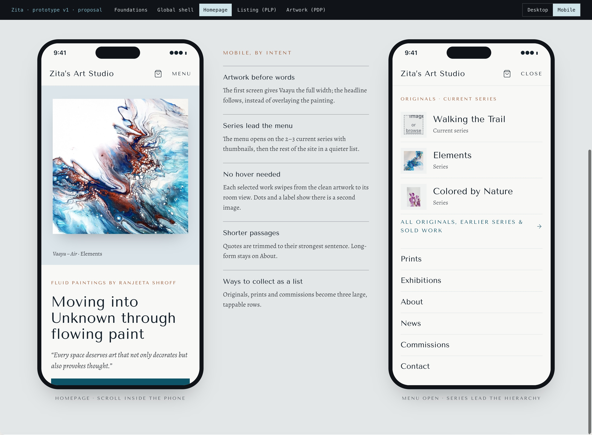
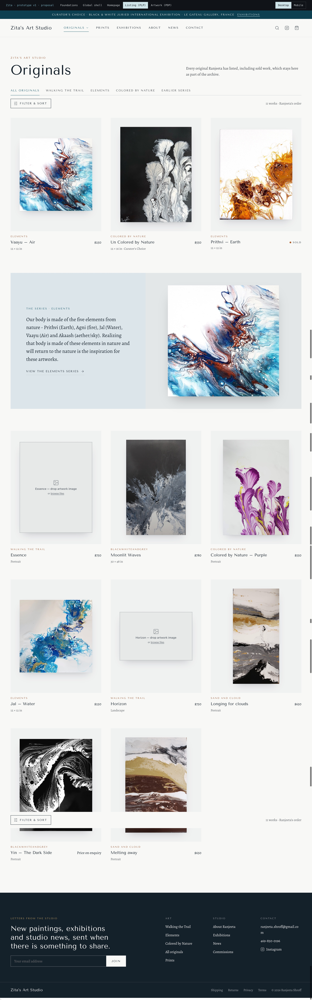
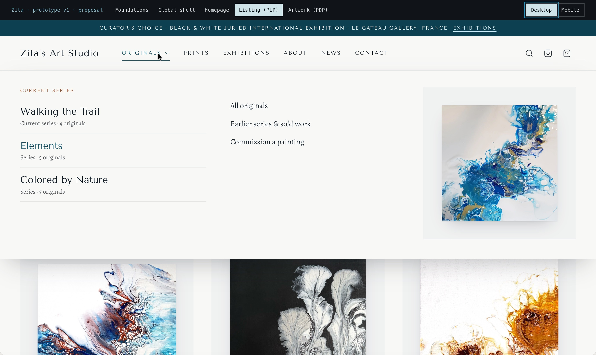
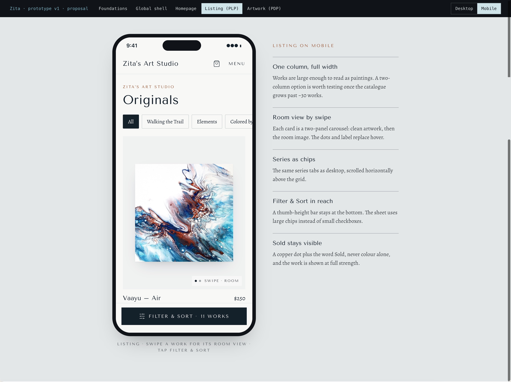
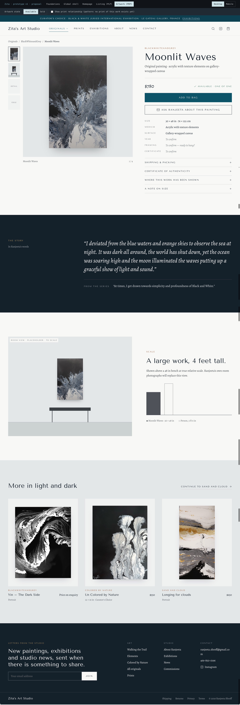
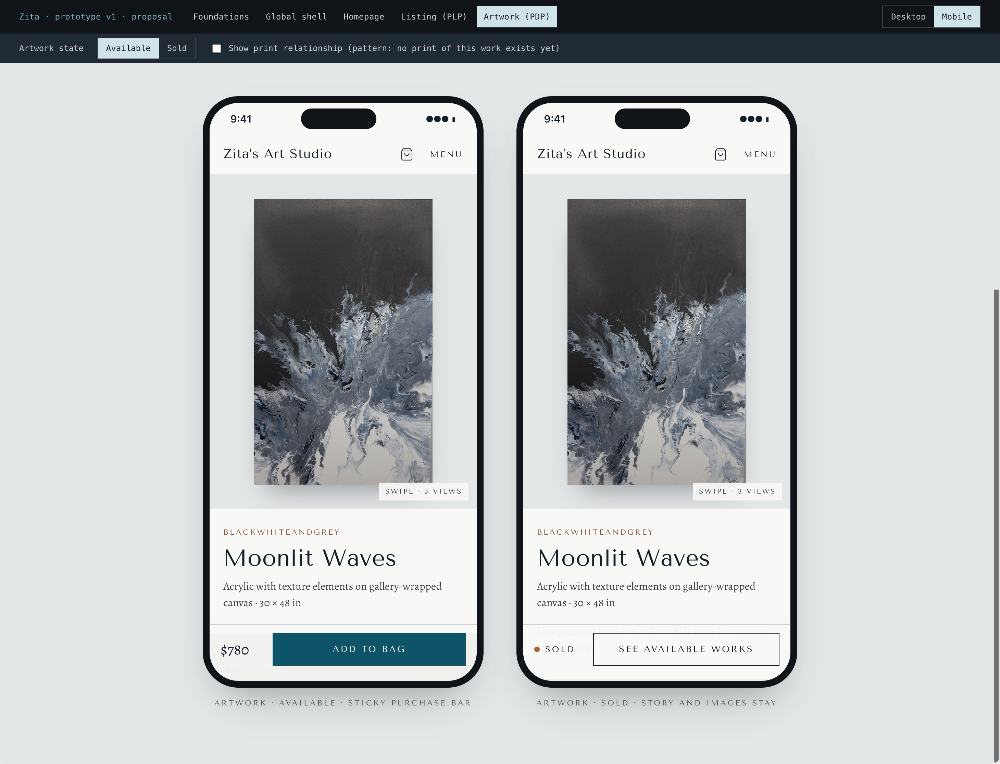

# Zita's Art Studio — Design V1

**Design V1** is a historical design exploration retained for design history and comparison. It has been **superseded by Design V2** and must **not** be treated as the current implementation reference.

For the approved direction, review [Design V2](../v2/README.md).

---

## Foundations

Palette, typography, and core visual tokens from the first Claude Design exploration.

## Global Shell

Header, wordmark placement, and primary navigation from the V1 prototype.

## Homepage — Desktop

Desktop homepage layout and rhythm from the V1 exploration.

## Homepage — Mobile

Mobile homepage treatment from the V1 exploration.

## Originals Listing / PLP — Desktop

Desktop originals collection listing (PLP) from V1.

## Originals Navigation / Menu — Desktop

Desktop navigation or menu state related to originals browsing in V1.

## Originals Listing / PLP — Mobile

Mobile originals listing (PLP) from V1.

## Artwork / PDP — Desktop

Desktop artwork product detail page from V1.

## Artwork / PDP — Mobile

Mobile artwork product detail page from V1.

---

## Status

V1 is **archived for reference only**. **Design V2** is the approved direction for Shopify implementation.

→ [Zita's Art Studio — Design V2](../v2/README.md)
