# Zita's Art Studio — Design V2

**Design V2** is the **approved design direction** from the October 2026 design review. These screenshots are the **primary visual reference** for Shopify architecture and implementation.

Written requirements and client decisions remain authoritative in `docs/design/`, especially [design-v2-acceptance.md](../../../../docs/design/design-v2-acceptance.md). Screenshots communicate **visual intent**; they must not be read as requiring hard-coded prototype content or Claude-only controls in the production Shopify theme. Placeholder artwork and copy in the captures are not final product data.

---

## Foundations

Approved V2 palette roles, typography (Marcellus + Mulish), wordmark direction, and related brand foundations.



## Global Shell & Navigation

Approved header, wordmark (`ZITA'S | ART STUDIO`), and global chrome that frames the storefront experience.

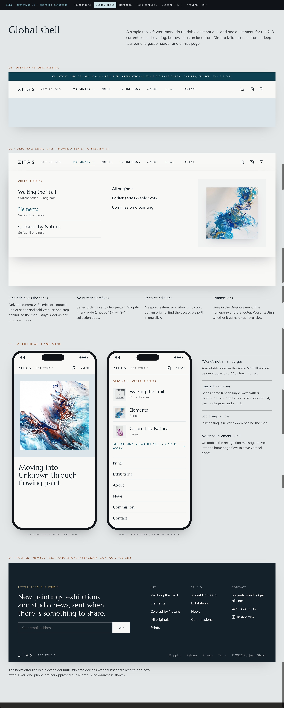

## Hero Carousel

Full-width rotating homepage hero carousel with artwork as the visual focus.



## Homepage — Desktop

Approved desktop homepage composition, including hero carousel, Current Series, Selected Works, editorial storytelling, and commerce pathways.



## Homepage — Mobile Overview

Mobile homepage overview showing how major homepage sections stack and read on small screens.

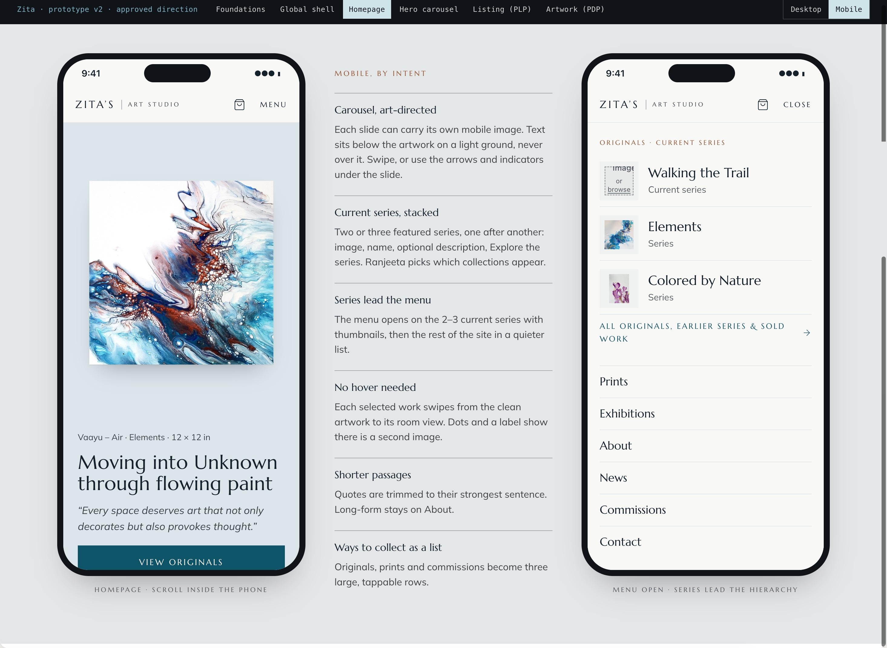

## Homepage — Mobile

Mobile homepage detail aligned with the approved V2 homepage structure.



## Homepage — Mobile Menu

Mobile navigation menu demonstrating the **same content hierarchy** as desktop, adapted for touch—not a separate information architecture.

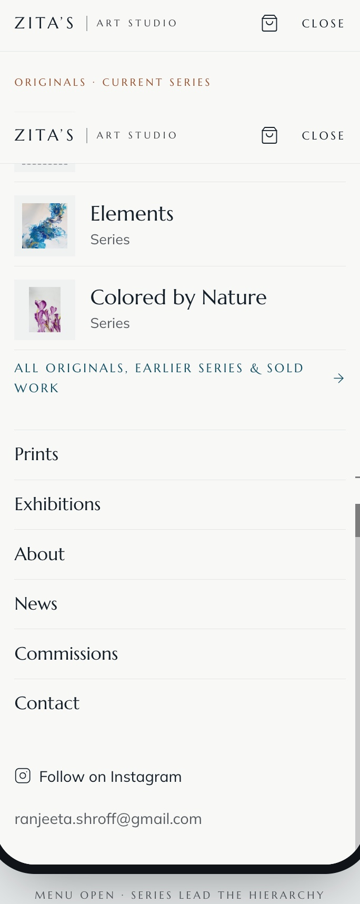

## Originals Listing / PLP — Desktop

Artwork-first originals PLP: wide layout, aligned artwork rows, and on-demand Filter & Sort direction.



## Originals Collection Navigation — Desktop

Approved **Originals dropdown / mega-menu** concept: spacious access to active series and related originals destinations. Menu **labels, links, nesting, and order** are intended to be **merchant-managed through Shopify navigation**, not hard-coded collection names in theme code.

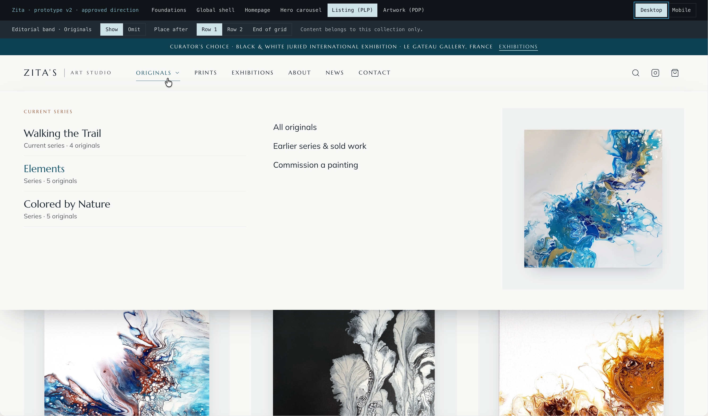

## Originals Listing / PLP — Mobile Overview

Mobile PLP overview showing layout and browsing rhythm on small screens.

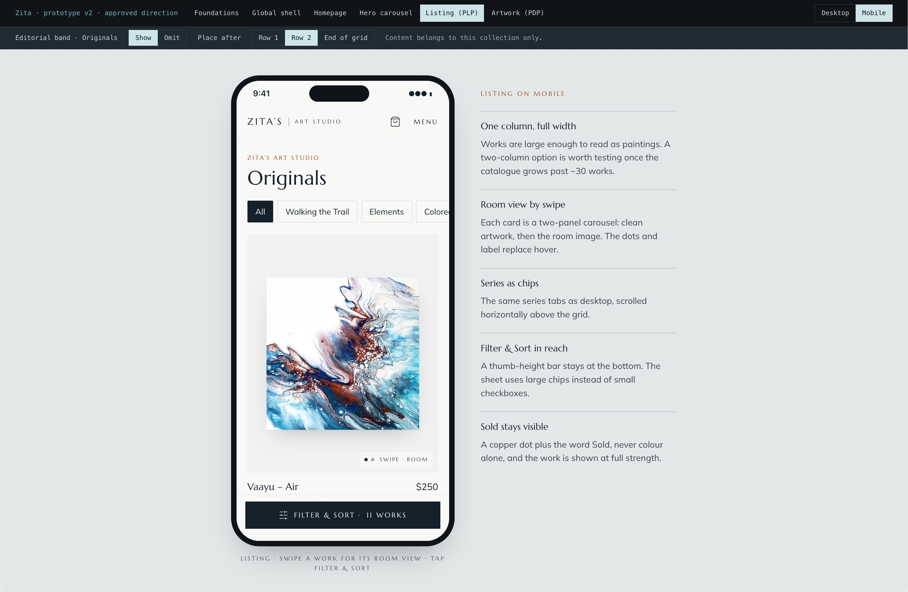

## Originals Listing / PLP — Mobile

Mobile originals listing with artwork-first, single-column direction for the current catalogue scale.

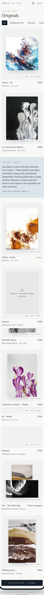

## Artwork / PDP — Desktop, Available

Desktop artwork detail page for an **available** original: Gesso/light neutral artwork ground, story, and clear purchase path.

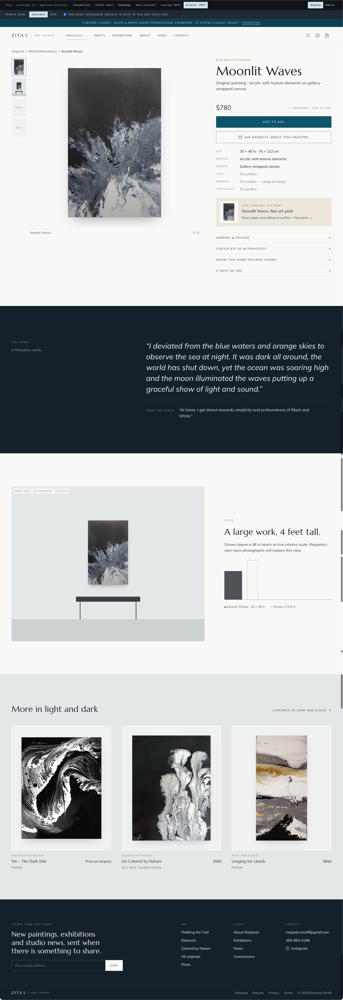

## Artwork / PDP — Desktop, Sold

Same PDP pattern for a **sold** work: artwork and story remain visible with an unambiguous sold state (not a separate page design).

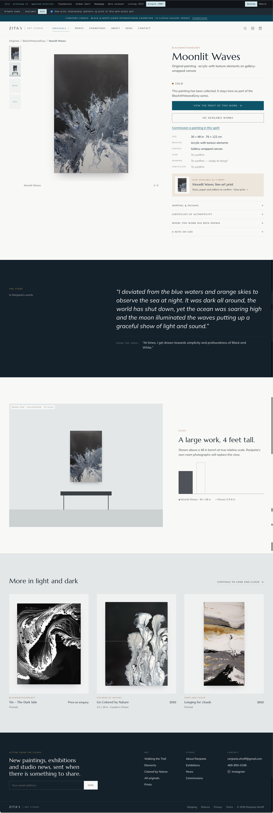

## Artwork / PDP — Mobile Overview

Mobile PDP overview showing layout and content hierarchy on small screens.

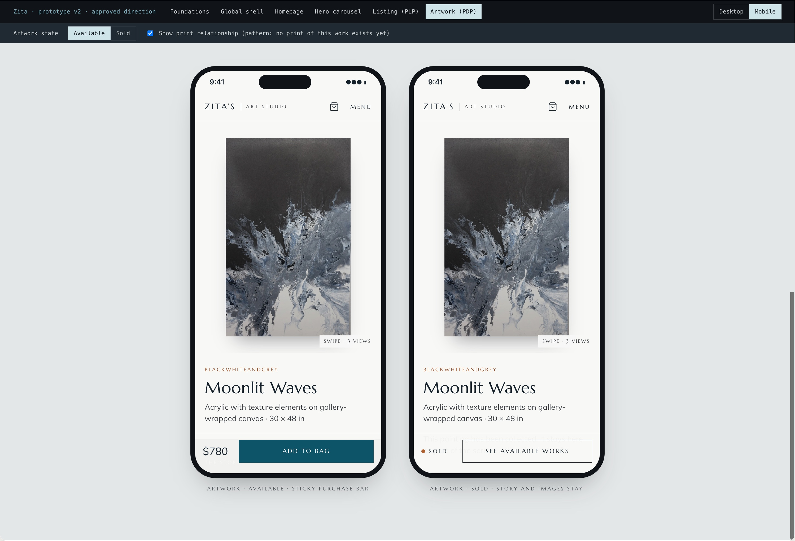

## Artwork / PDP — Mobile, Available

Mobile artwork detail for an **available** original, consistent with the approved gallery-like PDP direction.

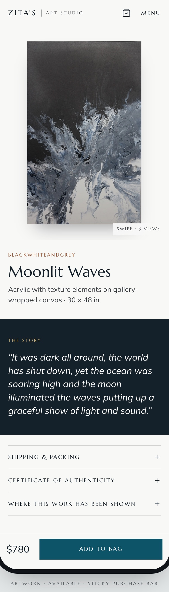

---

## Implementation Reference

- **V2** is the approved visual baseline for Shopify theme work.
- Implementation should preserve design intent using maintainable, native Shopify structures (menus, sections, product/collection data).
- Merchant-managed content (navigation, carousel, featured series, collection editorial bands, products) must remain editable without code changes where the design docs specify.
- If a screenshot and written documentation disagree, consult the design docs rather than inferring from the image alone.

**Written references:**

- [Design V2 Acceptance](../../../../docs/design/design-v2-acceptance.md)
- [Ranjeeta Preferences](../../../../docs/design/ranjeeta-preferences.md)
- [Zita Design Brief](../../../../docs/design/zita-design-brief.md)
